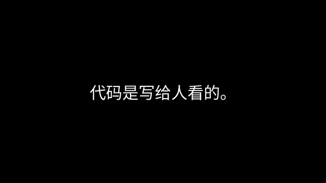

# text-to-simple-video

把一段文本（中文 / 英文 / 中英混杂）变成黑底白字、edge-tts 朗读的视频。每句依次出现，朗读完毕自动切下一句。



> ↑ 静音预览（实际输出含 edge-tts 朗读）。这段 demo 用 `--voice ava-ml` 渲染中英混杂。

## 安装

需要 Python 3.9+ 和 `ffmpeg`（`brew install ffmpeg` / `apt install ffmpeg`）。

```bash
bash setup.sh
# 国内网络慢:    bash setup.sh --mirror https://gh-proxy.com/
# 不下开源字体:  bash setup.sh --skip-fonts
```

会建 `.venv/`、`pip install -e .`（注册 `t2sv` 命令）、拉 3 个开源中文字体到 `fonts/`。

## 使用

```bash
source .venv/bin/activate                     # 或直接用 .venv/bin/t2sv

t2sv sample.txt                                # 交互菜单（10s 倒计时回车默认）
t2sv --text "人生不是一场赛跑。"
t2sv sample.txt --no-prompt                    # 全默认，无菜单
t2sv sample.txt --voice yunxi --resolution 1080p,vertical-1080
t2sv --version  /  --help  /  --list-voices
```

- 输入：裸文件名优先到 `text/` 找；也接受绝对路径或 `--text`。
- 输出：每次跑生成 `video/<项目名>/<voice>_<resolution>.mp4`；默认项目名 `<时间>_<input-stem>`，`-o foo` 自定义。
- 任意目录都能跑。负号开头的值用 `=`：`--rate=-10%` / `--volume=-20%`。

## 语音（21 个预设，`t2sv --list-voices` 查全）

| 区域 | key |
|---|---|
| 普通话 | xiaoxiao（默认）/ xiaoyi / yunxi / yunxia / yunyang / yunjian |
| 方言 | xiaobei（辽宁话）/ xiaoni（陕西话） |
| 粤语 | hiugaai / hiumaan / wanlung |
| 台湾国语 | hsiaochen / hsiaoyu / yunjhe |
| **中英混杂首选** | **ava-ml** / **andrew-ml**（微软 multilingual） |
| 英文·美式 | aria / guy / jenny |
| 英文·英式 | sonia / ryan |

`--voice` 也接受完整 edge-tts 名（如 `zh-CN-XiaomengNeural`）。

## 分辨率（8 个预设，多选）

| 类别 | key | 像素 |
|---|---|---|
| 横屏 | `720p`（默认）/ `1080p` / `1440p` / `4k` | 1280×720 ... 3840×2160 |
| 竖屏 | `vertical-720` / `vertical-1080` | 720×1280 / 1080×1920 |
| 方屏 | `square-720` / `square-1080` | 720×720 / 1080×1080 |

```bash
t2sv sample.txt --resolution 720p,vertical-1080,square-1080
t2sv sample.txt --resolution all          # 一次出 8 个；TTS 只跑一次
```

菜单里写 `1,3,5` / `1-3` / `all` 均可。

## 字体

启动时扫描：

- **系统字体**（按平台存在性过滤）：macOS（Hiragino / STHeiti / Songti），Linux（Noto CJK / 文泉驿），Windows（雅黑 / 黑体 / 宋体）
- **`fonts/` 下任意 `.ttf/.ttc/.otf`**（`fonts/download_fonts.py` 拉 OFL 字体：霞鹜文楷、思源黑体、思源宋体）

默认顺序见 `text_to_video.py` 顶部 `DEFAULT_FONT_KEYS`。苹果系统字体授权仅限本机，**不能 redistribute**，仓库里不放；想用 macOS 的楷体 / 圆体等，先用「字体册」下载，再 `--font /path/to/font.ttc`。

## 测试与开发

```bash
pip install -e ".[dev]"
pytest                # 42 个单元测试，~0.1s
```

详见 [tests/README.md](tests/README.md)。

## 已知限制

- edge-tts 在线 API（已加 2 次自动重试）；离线不可用。
- 交互倒计时基于 `select(stdin)`，Windows 请加 `--no-prompt`。
- 英文 `.` 切句启发式：`Mr. Smith` 会断（无害），`3.14` / `U.S.` 不破。

## License

MIT — 见 [LICENSE](LICENSE)。
